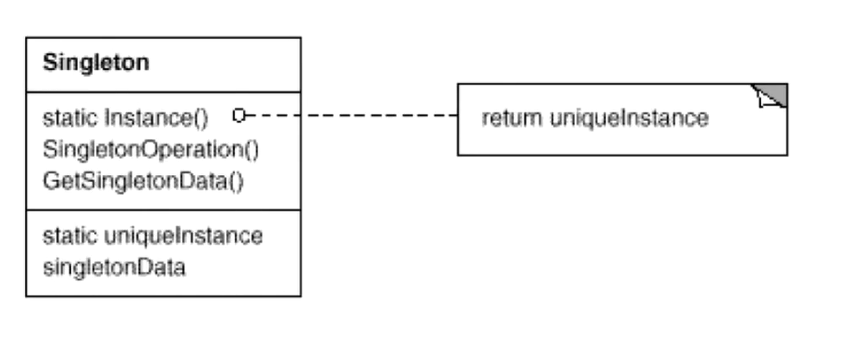

# Singleton

## 动机（Motivation）

- 在软件系统中，经常有这样一些特殊的类，必须保证它们在系统中只存在一个实例，才能保证它们的逻辑正确性以及良好的效率。
- 如果绕过常规的构造函数，提供一种机制来保证一个类只有一个实例？
- 这应该是类设计者的责任，而不是使用者的责任。

## 模式定义

> 保证一个类仅有一个实例，并提供该实例的全局访问点。—— 《设计模式》GoF

## 结构（structure）

## 要点总结

- Singleton 模式中的实例构造函数可以设置为 protected 以允许子类派生。
- Singleton 模式一般不要支持拷贝构造函数和 clone 接口，因为这有可能导致多个对象实例，与 Singleton 模式的设计初衷相违背。
- 如何实现多线程环境下安全的 Singleton？注意对双检查锁的正确实现。

